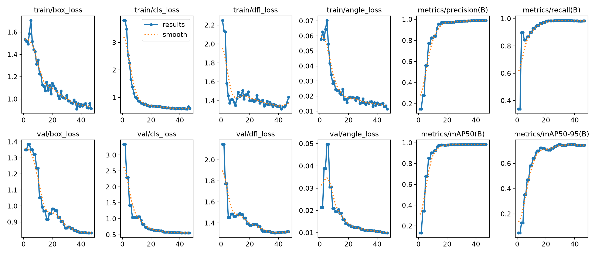

# YOLO Parking Slot 

Real-time parking slot occupancy detection system using YOLO OBB and OpenCV.  
ระบบตรวจจับและนับจำนวนที่จอดรถแบบเรียลไทม์ด้วย YOLO OBB และ OpenCV

---

## Workflow / ขั้นตอนการทำงาน
1. **Label data from CVAT:** ทำการตีเส้นกรอบข้อมูลภาพ (Annotation) ด้วย CVAT
2. **Create spot center:** กำหนดจุดศูนย์กลางพิกัดของแต่ละช่องจอด
3. **Train model:** ฝึกสอนโมเดล YOLO OBB สำหรับตรวจจับรถ

---

## Concepts / แนวคิดหลักของโปรเจค

* **OBB (Oriented Bounding Box):**  
  กรอบสี่เหลี่ยมแบบเอียงได้ (แตกต่างจากกรอบแนวนอนทั่วไป) ช่วยให้สามารถตรวจจับรถที่จอดเอียงตามแนวช่องจอดได้อย่างแม่นยำ ไม่ซ้อนทับกันเกินความจำเป็น

* **Center Spot Concept:**  
  แนวคิดในการตรวจสอบสถานะช่องจอด โดยการบันทึกพิกัดจุดศูนย์กลาง (`center`) ของแต่ละช่องจอด แล้วใช้ฟังก์ชันทางเรขาคณิตตรวจสอบว่า มีกรอบพิกัดของรถคันใดมาทับจุดศูนย์กลางนั้นหรือไม่ หากมีแสดงว่าไม่ว่าง (Occupied) หากไม่มีแสดงว่าว่าง (Available)

---

## Training Results / ผลลัพธ์การ Train



## Folder Structure
``` 📦 YOLO Parking Space Detector
├── 📂 dataset/
│   ├── 📄 data.yaml
│   ├── 📂 images/train/ (frame_*.jpg)
│   └── 📂 labels/train/ (frame_*.txt)
├── 📂 runs/obb/train/        # ผลลัพธ์จากการ Train (Weights & Metrics)
├── 📂 utils/                # สคริปต์ช่วยเตรียมข้อมูลและแปลงไฟล์
│   ├── convert_coco.py
│   ├── create_slot_center.py
│   └── prepare_vdotoimg.py
├── 📄 main.py               # ไฟล์รันระบบหลัก (Real-time Detection)
├── 📄 train.py              # ไฟล์สำหรับเทรนโมเดล YOLO OBB
├── 📄 parking_slots_center.json # ไฟล์พิกัดจุดศูนย์กลางช่องจอด
├── 📄 requirements.txt
├── 🎥 carparking.mp4        # วิดีโอต้นทาง
├── 🎥 carparking-output.mp4 # วิดีโอผลลัพธ์
└── 📄 README.md ```
